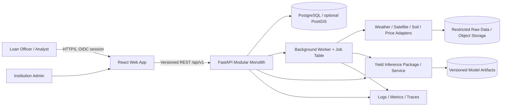

# System Architecture

## Context


## Trust boundaries and flows
- Browser is untrusted; validate every input on API.
- API-to-database boundary uses least-privilege credentials, TLS where supported, parameterized ORM queries and tenant-scoped access.
- Provider boundary: outbound allowlist, timeouts, credentials in secret manager, no user-supplied arbitrary URL fetching.
- ML boundary: strict typed schema, bounded payload size, version compatibility checks, timeout and no access to DB secrets.
- Raw data/artifacts: restricted bucket, encryption, checksum/version and retention policy.
- Logs: redact borrower identifiers, financial values where not needed, tokens, credentials and raw provider payloads.

## Backend modules
`identity`, `institutions`, `borrowers`, `farms`, `crop_cycles`, `loans`, `climate_data`, `market_data`, `data_quality`, `yield_inference`, `income`, `credit_assessment`, `scenarios`, `explanations`, `monitoring`, `reports`, `audit`, `jobs`.

## Assessment sequence
```mermaid
sequenceDiagram
  actor U as Authorized User
  participant W as Web
  participant A as API
  participant D as PostgreSQL
  participant P as Provider Adapters
  participant M as ML Inference
  U->>W: Submit assessment request + idempotency key
  W->>A: POST /api/v1/assessments
  A->>A: Authenticate, authorize, validate
  A->>D: Create assessment/job snapshot (transaction)
  A-->>W: 202 Accepted + assessment_id/job_id
  A->>P: Retrieve/validate data (worker if asynchronous)
  P-->>A: Normalized inputs + provenance/quality
  A->>M: Yield inference contract
  M-->>A: Yield estimate + version + limitations
  A->>A: Calculate income; invoke credit model only if gate enabled
  A->>D: Save immutable result, explanations, audit events
  A-->>W: Result available (poll endpoint)
```

## Failure policy
- Provider timeout: bounded retries for safe reads; persist `UNAVAILABLE`, keep job failed/partial with reason.
- Stale inputs: continue only if policy explicitly allows; display stale status and limit interpretation.
- Invalid ML schema/version: reject output, mark assessment failed; do not silently coerce.
- Duplicate submission: idempotency key returns same assessment/job result.
- DB transaction failure: no partial “completed” assessment; record operational failure outside failed transaction where possible.
- Model version mismatch: assessment cannot finalize until compatible artifact is selected.

## ADRs
See `09-technology-stack-and-decisions.md` and `23-open-questions-and-architecture-decisions.md`.
