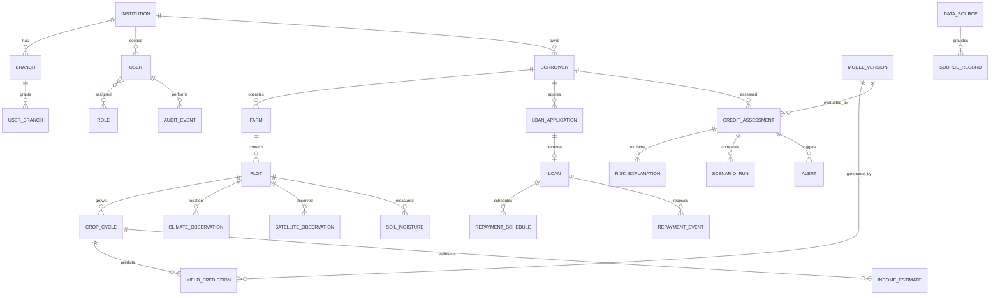

# Database Schema and ERD

## ER diagram (logical)

## Schema conventions
Use UUID primary keys; `institution_id` on every tenant-owned row; `created_at`, `updated_at` where mutable; UTC `timestamptz`; numeric types for money/measurements; explicit `currency`, `unit`, `source_id`, `quality_status`; foreign keys and check constraints; soft deletion only where policy allows; assessment snapshots are append-only.

## Entity inventory (fields are proposed baseline; refine through migrations)
| Entity | Key fields / types | Relationships, indexes and constraints | Sensitivity / retention |
|---|---|---|---|
| institution | id UUID, name, status | unique normalized name as policy allows | business data; contract retention |
| branch | id, institution_id, name, code | unique institution+code | business data |
| user | id, institution_id, external_subject, email, status | unique issuer+subject; email index | personal; retain per identity policy |
| role / permission | id, code, description | unique code; role_permission join | security configuration |
| user_branch | user_id, branch_id, scope | unique user+branch | access-control record; audit changes |
| borrower | id, institution_id, branch_id, external_ref, display_name, contact fields as needed | indexes tenant+external_ref; minimize PII | high; legal retention/deletion policy |
| farm | id, institution_id, borrower_id, location/geometry, area, unit | index tenant+borrower; geometry index if PostGIS | location sensitive |
| plot | id, farm_id, geometry, area, soil metadata | farm index; SRID/area checks | location/production data |
| crop_cycle | id, plot_id, crop_code, sowing_date, harvest_date, season, irrigation fields | index plot+season; date check | production data |
| climate_observation | id, plot_id, variable, value, unit, observed_at, source_id, quality | index plot+variable+time; dedup key | farm location/time |
| forecast | id, plot_id, variable, value, unit, issued_at, valid_time, provider_model | index plot+valid_time; source dedup | farm location/time |
| satellite_observation | id, plot_id, product, index_value, cloud_fraction, acquired_at, processing_version | index plot+acquired_at | location/production data |
| soil_moisture | id, plot_id, value, unit, depth, observed_at, source_id | index plot+observed_at | production data |
| market_price | id, commodity, market, value, currency, unit, observed_at, source_id | index commodity+market+observed_at | low/moderate; source terms |
| loan_application | id, borrower_id, branch_id, amount, currency, purpose, status, submitted_at | tenant/status index | high financial data |
| loan | id, application_id, principal, currency, rate terms, dates, status | unique application if one-to-one policy | high financial data |
| repayment_schedule | id, loan_id, version, due_date, amount_due, currency | loan+version+due_date index | high financial data; immutable versions |
| repayment_event | id, loan_id, schedule_id, paid_at, amount_paid, status, source_id | loan+paid_at index | high financial data |
| yield_prediction | id, crop_cycle_id, value, unit, horizon, model_version_id, quality, interval | cycle+created_at index | derived farm data |
| income_estimate | id, crop_cycle_id, gross_revenue, costs, net_income, IADS, currency, assumptions_version | cycle+created_at index | financial data |
| credit_assessment | id, borrower_id, loan_id, status, result_type, PD nullable, risk_band nullable, snapshot JSON, input_manifest_id, model_version_id, trigger, completed_at | tenant+borrower+created_at; immutable after completion | highly sensitive; retention policy |
| scenario_run | id, assessment_id, scenario_code, assumptions JSON, result JSON, evidence_status | assessment index | derived sensitive data |
| risk_explanation | id, assessment_id, factor_code, contribution, unit, direction, explanation_type, caveat | assessment index | derived sensitive data |
| alert | id, institution_id, assessment_id, rule_code, status, created_at | tenant+status index; dedup key | sensitive; notification retention |
| model_version | id, name, version, artifact_uri, checksum, feature_schema_version, metrics JSON, status, approved_at | unique name+version | operational/model governance |
| data_source | id, name, type, terms_uri, license_ref, status, owner | unique name+version | provider credentials kept elsewhere |
| source_record | id, source_id, external_id, retrieved_at, checksum, raw_uri, transform_version, quality | source+external_id+version index | may contain sensitive raw data |
| audit_event | id, institution_id, actor_id, action, object_type, object_id, request_id, timestamp, metadata_redacted | tenant+timestamp, actor+timestamp | append-only; restricted |
| job | id, type, status, idempotency_key, payload_ref, attempts, available_at, started_at, completed_at, error_code | unique idempotency key per scope; status+available_at | avoid PII in payload/logs |

## Database rules
- All tenant queries must be scoped by authenticated institution and, where applicable, branch. Consider PostgreSQL row-level security as defense in depth, not a replacement for application authorization.
- Use transactions for loan schedule changes, assessment completion and associated audit events. Keep external calls outside long DB transactions.
- Assessment completion writes result, provenance and model version atomically; completed snapshots are immutable. Corrections create a new assessment/version.
- Optimistic concurrency via `updated_at`/version column for mutable profile records. Idempotency key for assessment/job creation.
- Encrypt backups and restrict restore permissions; define retention and deletion policy with institutional/legal owner.
