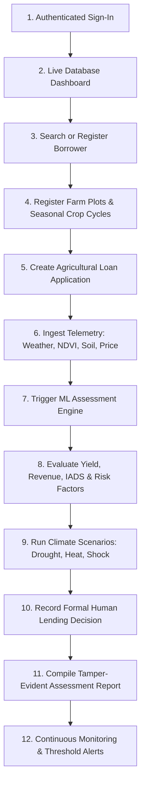

# Architecture Blueprint — TerraTrust AI

## 1. System Overview & Purpose

**TerraTrust AI** (FIN-03 Climate-Aware Agricultural Credit Risk Assessment System) is an enterprise financial-technology decision-support platform engineered for agricultural lenders, rural cooperative banks, and credit committees. 

The platform models physical crop yields, estimates farm debt-service capacity (Income Available for Debt Service — IADS), evaluates bounded climate stress scenarios (drought, heat, flood, price volatility), and presents an immutable, explainable assessment dossier to authorized lending officers for formal credit approval.

```
┌─────────────────────────────────────────────────────────────────────────────┐
│                             TERRATRUST AI PLATFORM                          │
├──────────────────────────┬──────────────────────────┬───────────────────────┤
│    CLIENT PRESENTATION   │    CORE BACKEND & ORM    │   AI / ML & SATELLITE │
│                          │                          │                       │
│  React 18 / TypeScript   │  FastAPI (ASGI, Python)  │ ExtraTreesRegressor   │
│  Vite, TailwindCSS       │  SQLAlchemy 2.0 ORM      │ Kaggle Soil-Yield     │
│  TanStack Query v5       │  PostgreSQL / PostGIS    │ Zenodo CY-Bench       │
│  Role-Based UI Routing   │  JWT Auth & RBAC         │ Sentinel-2 / NASA SMAP│
└──────────────────────────┴──────────────────────────┴───────────────────────┘
```

---

## 2. End-to-End Loan Officer Workflow

The operational flow implements the 12-step loan officer journey:



1. **Sign-In & Auth**: Officers sign in via `POST /api/v1/auth/login` receiving an RS256/HS256 JWT access token. User roles (`LOAN_OFFICER`, `RISK_ANALYST`, `INSTITUTION_ADMIN`) and institutional branch scopes are enforced on every request.
2. **Dashboard**: Metrics aggregate live from PostgreSQL across registered borrowers, active loan facilities, completed assessments, and active satellite telemetry.
3. **Borrower Management**: Officers search and register farmers (`POST /borrowers`) with duplicate checks, masking PII.
4. **Farms & Crop Cycles**: Farms (`POST /farms`) and seasonal cycles (`POST /farms/{farm_id}/crop-cycles`) record plot geometries, soil types, sowing dates, and expected harvests.
5. **Loan Applications**: Linked credit facilities (`POST /loan-applications`) track requested principal, tenors (3–36 months), repayment schedules, and purpose.
6. **Data Collection**: Retrieves observation records for weather (IMD/ECMWF), Sentinel-2 vegetation vigor (NDVI/EVI), root-zone moisture (NASA SMAP), and statutory MSP/FRP market prices.
7. **ML Assessment Execution**: `POST /assessments` binds the borrower, farm, and crop cycle to the physical yield inference model and financial cash-flow calculator.
8. **Risk Assessment Display**: Displays predicted yield (tonnes/ha), gross revenue, cultivation costs, net farm income, and IADS.
9. **Climate Scenarios**: `POST /assessments/{id}/scenarios` evaluates bounded stress shocks (e.g. `DROUGHT_SEVERE`, `HEAT_STRESS`, `PRICE_SHOCK_20`).
10. **Human Lending Decision**: `POST /assessments/{id}/review-decision` seals formal credit committee actions (`APPROVE`, `CONDITIONALLY_APPROVE`, `REJECT`) with auditable rationale and disbursement covenants.
11. **Assessment Report**: `POST /assessments/{id}/reports` compiles an audit memorandum and streaming PDF export.
12. **Monitoring & Alerts**: Scheduled rules evaluate fresh meteorological telemetry against risk limits, notifying officers of adverse weather events.

---

## 3. Component Architecture

### 3.1 Frontend (`apps/web`)
- **Framework**: React 18, TypeScript 5, Vite 5.
- **State Management**: TanStack React Query v5 for server-side caching, cache invalidation, and optimistic mutations.
- **Styling**: Tailwind CSS with custom palette: deep forest green (`primary-900`), navy typography (`slate-900`), and warm background neutrals (`neutral-50`).
- **Form Validation**: React Hook Form with Zod schemas.
- **Component Design**: Modular PageHeaders, DetailCards, MetricCards, StatusBadges, RiskGauges, and EvidencePanels.

### 3.2 Backend (`apps/api`)
- **Framework**: FastAPI (Python 3.12).
- **ORM & Database**: SQLAlchemy 2.0 with connection pooling; PostgreSQL in production, isolated in-memory SQLite in testing.
- **Security Middleware**: CORS origin verification, Security Headers (HSTS, CSP, X-Frame-Options, X-Content-Type-Options), Request ID correlation context, and audit journal logging.
- **Authentication**: OAuth2 Password Bearer flow with bcrypt password hashing (`passlib`) and JWT verification (`PyJWT`). Rate limiting protects login routes against brute-force attacks.

### 3.3 AI/ML Decision Engine (`apps/api/app/services`)
- **Yield Inference Engine** (`crop_yield_predictor.py`): Loads trained 33.2MB `ExtraTreesRegressor` model trained on soil nutrients and temperature (`Fertilizer`, `temp`, `N`, `P`, `K`).
- **Financial Cash-Flow Calculator** (`income_calculator.py`): Translates physical yield into monetary debt-service capacity:
  $$\text{Gross Revenue} = \text{Yield} \times \text{Area} \times (1 - \text{Loss}\%) \times \text{Price}$$
  $$\text{Net Farm Income} = \text{Gross Revenue} - \text{Production Costs} - \text{Other Expenses}$$
  $$\text{IADS} = \text{Net Farm Income} + \text{Off-Farm Income} - \text{Existing Debt Obligations}$$
- **Climate Stress Engine** (`scenario_engine.py`): Models deterministic and non-linear yield degradation under drought, heatwaves, and commodity price drops.
- **Regulatory Model Gate**: Adheres to strict credit governance. Because the repository contains only a physical crop yield model and no validated loan default dataset, repayment probability is **strictly gated** as `PD_UNAVAILABLE` with reason *"Credit probability unavailable — model not yet validated"*. Fabricated default probabilities are prohibited.

---

## 4. Security & Compliance Controls

1. **Authentication & Sessions**: Passwords hashed using bcrypt. Access tokens expire within 60 minutes. Logout blacklists active tokens.
2. **Role-Based Access Control (RBAC)**: Backend endpoints strictly enforce `require_roles`:
   - `ROLE_LOAN_OFFICER`: Manage borrowers, farms, loan applications, initiate assessments, record review decisions.
   - `ROLE_RISK_ANALYST`: Simulate scenarios, inspect risk explanations, configure monitoring rules.
   - `ROLE_INSTITUTION_ADMIN`: User management, branch scoping, institutional policy.
3. **Branch Scoping**: Officers can only access borrowers and farms within their assigned geographical branches (`verify_branch_access`).
4. **Audit Trail**: Every mutation (`BORROWER_CREATED`, `FARM_CREATED`, `LOAN_APPLICATION_CREATED`, `ASSESSMENT_DECISION_RECORDED`) writes immutable audit events with actor ID, timestamp, and request correlation ID.
5. **Data Protection & PII Masking**: Borrower identity numbers are masked; farm coordinates can be redacted in public views.
